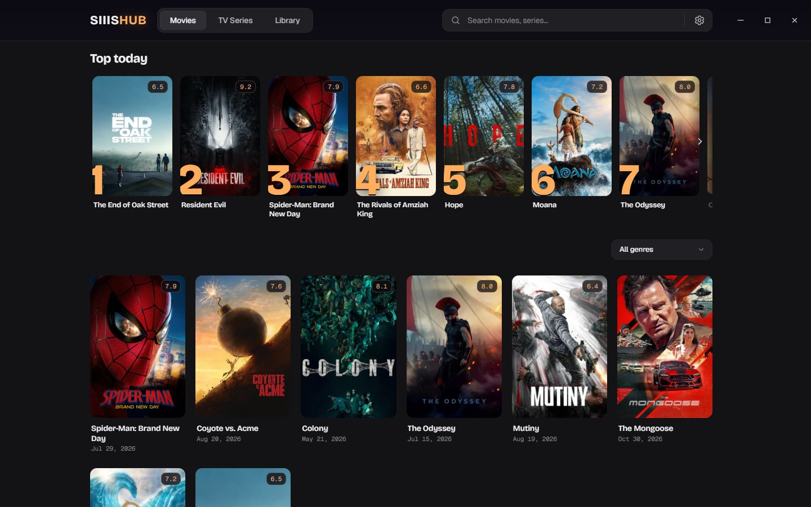
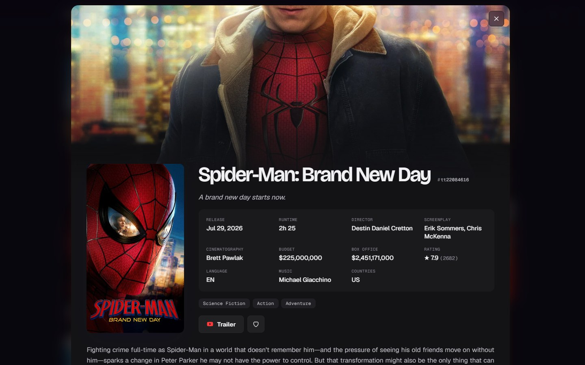
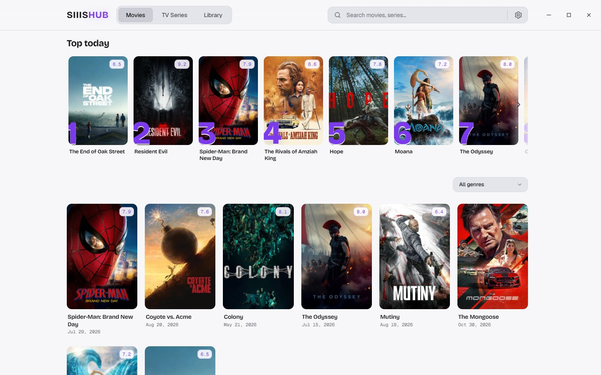
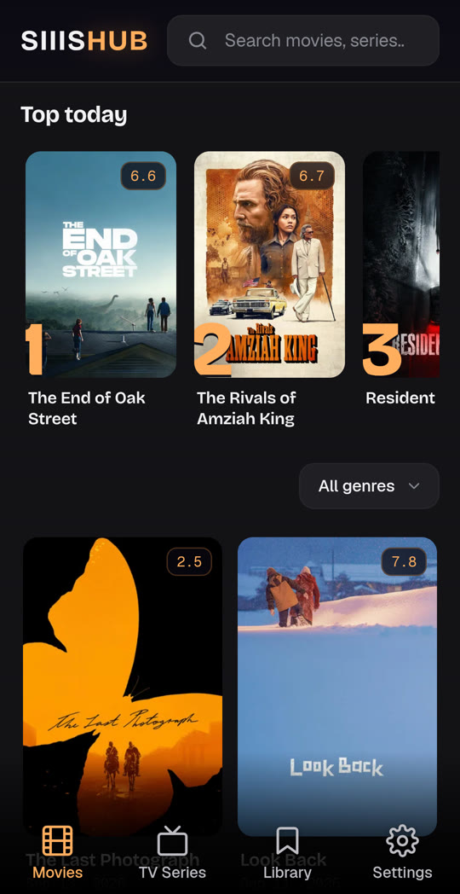
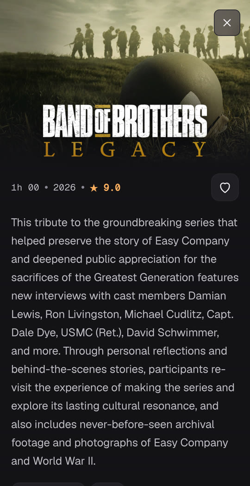
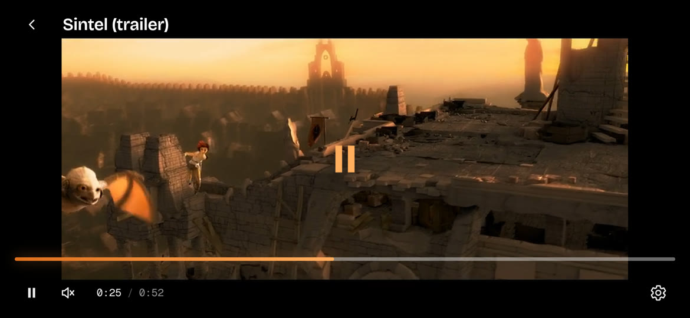

  

<h1 align="center">SIIISHUB</h1>

  <strong>Find a title. Pick a stream. Press play.</strong> 
  A fast, good-looking streaming hub for Windows, Linux, Android and Android TV, with the mpv player built in, or in your browser from your own server.

  
  
  

---

Movie night should not mean juggling browser tabs, pop-ups and an external
player. SIIISHUB puts everything in one place: browse what is trending, open a
title, see every stream your addons can find ranked by quality, and start
watching in seconds, in a real mpv player that plays nearly any file you throw
at it.

It talks to Stremio-compatible addons, streams torrents while they download,
starts cached links instantly through Real-Debrid or AllDebrid, and remembers
where you stopped. No account, no ads, no tracking. Just your library, on your
device.

  

<table>
  <tr>
    <td width="50%"></td>
    <td width="50%"></td>
  </tr>
</table>

  
  &nbsp;
  

  
   Video in the player: Sintel trailer, © Blender Foundation, CC BY 3.0

## Highlights

### Discover

- **Trending today**, movies and TV series by genre, and instant search, powered by TMDB.
- **Rich detail pages** with synopsis, cast and crew, seasons and episodes, ratings and trailers.
- **Your language, your look:** 23 interface languages and six dark and light themes.

### Watch

- **mpv inside:** hardware-accelerated playback of MKV and HEVC, multiple audio tracks and styled ASS subtitles.
- **Every stream in one list,** from any Stremio-compatible addon, sorted by quality or seeders and filtered by resolution or addon.
- **Torrent streaming** with librqbit: playback starts while the file is still downloading.
- **Real-Debrid and AllDebrid:** cached torrents start instantly from a high-speed CDN.
- **Smart tracks:** your preferred audio and subtitle languages are picked automatically, and subtitle search, subtitle sync and playback speed are one tap away.
- **Resume** exactly where you left off.

### Keep

- **Library** with Continue watching, Favorites and Downloads.
- **Downloads** over P2P or through your debrid service, from magnet links and .torrent files, or drop in your own videos.
- **Tidy folders:** every download folder shows its poster as the icon in Explorer and in Linux file managers.

### Everywhere

- **Desktop app** for Windows and Linux in a clean, borderless window.
- **Remote control:** scan a QR code with your phone, in the browser or in the SIIISHUB Android app, approve it once and control playback from the couch, on a PC, on Android TV or in the browser version.
- **Android app** made for touch: bottom navigation, a full-screen landscape player and pinch to fill the screen.
- **Android TV app** with the interface of the desktop app, driven with the TV remote: the D-pad moves between titles and controls, and in the player it seeks and pauses.
- **In your browser:** run the server version on a NAS or a mini PC with Docker and watch from any browser, phones and TVs included. Files the browser cannot play are converted on the fly, on the GPU when the server has one. See [docs/WEB.md](docs/WEB.md).
- **One library on every device:** the server version keeps accounts. Sign in to yours from the apps and your library, favorites, addons, keys and preferences follow you; downloads stay on each device.

## Download

Get the latest build from the [Releases](../../releases/latest) page.

| Platform | Package |
|---|---|
| Windows 10 and 11, 64-bit | `SIIISHUB_<version>_x64-setup.exe` |
| Debian 13+, Ubuntu 24.04+, 64-bit | `SIIISHUB_<version>_amd64.deb` |
| Android 8.0+ phones and tablets | `SIIISHUB_<version>_arm64.apk`, or `_armv7.apk` for older 32-bit devices |
| Android TV and Google TV | `SIIISHUB-TV_<version>_arm64.apk`, or `_armv7.apk` for TVs with a 32-bit system |
| Docker: NAS, mini PC, server | `ghcr.io/spettrix01/siiishub`, set up as in [docs/WEB.md](docs/WEB.md) |

The packages are not code-signed, so Windows SmartScreen and Android ask for
confirmation the first time.

## Getting started

1. **TMDB key.** Create a free account on [TMDB](https://www.themoviedb.org/settings/api), request an API key (v3) and paste it in *Settings → TMDB*.
2. **Addons.** Paste the manifest URL of the Stremio-compatible stream and subtitle addons you want to use in *Settings → Stremio Addons*. SIIISHUB comes with none.
3. **Debrid, optional.** Choose Real-Debrid or AllDebrid in *Settings → Download* and paste your API key.

Then open any title, pick a stream and enjoy.

## Build from source

[docs/BUILDING.md](docs/BUILDING.md) covers Windows, Linux and Android, and
[docs/ARCHITECTURE.md](docs/ARCHITECTURE.md) explains how the pieces fit
together.

## Privacy

SIIISHUB has no cloud account, no telemetry and no server of its own. Settings
and API keys stay on your device, or on your own server for the browser
version and the accounts you make there.
The app connects only to TMDB, to the addons and the debrid service you
configure, to torrent peers and trackers, and to Google Fonts for the
interface fonts. The remote control of the desktop and TV apps listens on
your local network, and every new device has to be approved.

## Legal notice

SIIISHUB is a media player and a client for the Stremio addon protocol. It does
not host, index or distribute any content, and it ships without any addon or
source. You decide what to connect to it, and you are responsible for
respecting copyright and the laws of your country.

This product uses the TMDB API but is not endorsed or certified by TMDB.
SIIISHUB is an independent project and is not affiliated with Stremio, TMDB,
Real-Debrid or AllDebrid.

## Acknowledgements

SIIISHUB is built on [mpv](https://mpv.io), [FFmpeg](https://ffmpeg.org),
[Tauri](https://tauri.app) and [librqbit](https://github.com/ikatson/rqbit).
The Android player uses [libmpv-android](https://github.com/jarnedemeulemeester/libmpv-android),
and the Windows build uses libmpv from
[mpv-winbuild-cmake](https://github.com/shinchiro/mpv-winbuild-cmake). Movie
and series data and images come from [TMDB](https://www.themoviedb.org).
The exact versions, licenses and sources of the components bundled in the
packages are listed in [THIRD_PARTY.md](THIRD_PARTY.md).

## License

SIIISHUB is free software, released under the
[GNU General Public License v3.0 or later](LICENSE).
